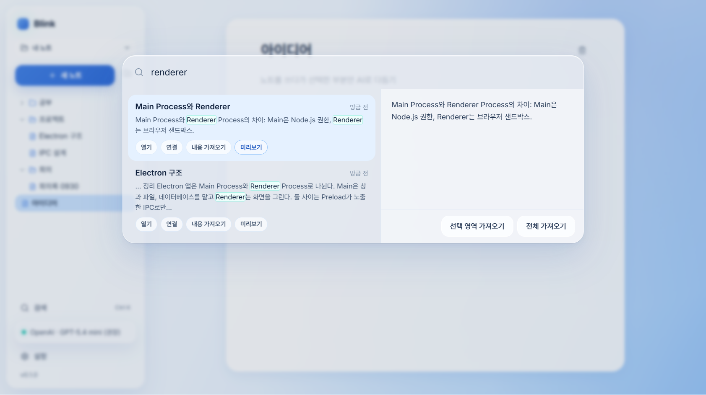

# Blink

## 1. 팀원

- 정보시스템학과 허정오
- 정보시스템학과 박석준

## 2. 한 문장 설명

> 내 폴더에 Markdown으로 쓰는 노트에서, 선택한 부분만 AI로 구체화·정리·시각화하고 과거 노트를 찾아 연결하는 데스크톱 노트 앱

## 3. 주요 화면

### 화면 1. 폴더 보관함과 노트 편집

내가 고른 폴더가 곧 보관함입니다. 폴더 구조가 사이드바 트리로 보이고, 노트는 `.md` 파일로 저장됩니다. 본문의 `[[노트 이름]]` 링크와 아래의 "이 노트를 참조하는 노트"로 노트끼리 이어집니다. 가운데 그림은 AI 시각화로 만든 인포그래픽(마인드맵)입니다.

### 화면 2. 선택 영역 AI 정리 — 처리 중 Pulse

문장을 선택하고 `정리`를 누르면 로딩 창 없이 선택 영역 자체가 천천히 깜빡이며(Pulse) 처리 중임을 보여 줍니다. 그동안 다른 부분은 계속 쓸 수 있고, 결과는 끝났을 때 한 번에 적용되며 잠깐 Mint 빛으로 표시됩니다.

### 화면 3. 과거 노트 검색 · 연결 · 가져오기

`Ctrl+K`로 제목·본문을 검색하고, 결과를 열거나 현재 노트에 링크로 연결하거나 내용(전체 또는 선택 영역)을 가져옵니다.

## 4. 주요 기능

### 1) 선택한 부분만 AI로 구체화 · 정리 · 시각화

본문에서 텍스트를 선택하면 나타나는 메뉴로 AI 작업을 요청합니다. **구체화**는 웹 검색으로 근거를 찾아 문장을 보강하고 끝에 출처 목록을 붙이고, **정리**는 흩어진 메모를 구조화된 Markdown으로 바꾸며, **시각화**는 원문 아래에 인포그래픽(과정·계층·비교·마인드맵)을 넣고 PNG로 저장할 수 있게 합니다. 작업은 백그라운드에서 돌고, 처리 중인 범위는 잠겨 있다가 성공했을 때만 한 번에 적용됩니다. 앱을 닫았다 열어도 결과가 들어갈 자리를 잃지 않습니다.

### 2) 과거 노트 검색 · 연결 · 가져오기

제목과 본문을 함께 검색해 스니펫으로 보여 주고, 현재 노트에 `[[링크]]`로 연결하거나 내용을 커서 위치로 가져옵니다. 링크는 옵시디언과 같은 `[[노트 이름]]` 형식이라 다른 앱에서도 그대로 읽히고, 노트 이름을 바꾸거나 옮기면 그 노트를 가리키던 링크도 함께 고쳐집니다.

### 3) 내 폴더에 Markdown으로 저장되는 노트 (보관함)

처음 실행할 때 고른 폴더가 보관함이 됩니다. 노트 = `.md` 파일, 폴더 = 사이드바의 폴더이며, 사이드바에서 폴더를 만들고·이름을 바꾸고·지우고, 노트를 끌어서 옮길 수 있습니다. 입력은 자동 저장되고(창을 닫기 직전 입력도 보존), 다른 앱에서 파일을 고치면 앱에 바로 반영됩니다. AI는 OpenAI 또는 Kimi 중에서 자신의 API Key와 모델로 설정합니다.

## 5. 시스템 구조

사용한 기술들이 어떻게 연결되어 있는지 보여 주는 구조도입니다 (AI로 제작, 이미지 오른쪽 위 `From AI` 표시).

- **Renderer**(React·Tiptap)는 화면만 맡고, 파일·DB·네트워크에는 직접 접근하지 않습니다. **Preload**가 허용된 채널만 `window.blink`로 노출합니다.
- **Main Process**는 도메인별(note · assist · ai-provider · visualization)로 나뉘고, 모든 IPC 요청을 Zod로 검증한 뒤 `{ ok, data | error }` 형태로 답합니다.
- 노트 원본은 **보관함 폴더의 `.md` 파일**이고, SQLite는 검색·링크 색인과 AI 작업 기록(보관함별 DB), AI 설정(API Key는 OS 보안 저장소로 암호화)만 담습니다.

## 6. 개발 도구 및 기술 스택

| 구분         | 도구 / 기술                                            | 버전                         |
| ------------ | ------------------------------------------------------ | ---------------------------- |
| AI 도구      | Claude Code                                            | Claude Opus 5.5              |
| 개발 언어    | TypeScript                                             | 6.0                          |
| 프레임워크   | Electron / React / Tiptap                              | 44.4 / 19.3 / 3.31           |
| 데이터베이스 | SQLite (better-sqlite3 · Drizzle ORM) + Markdown 파일 | SQLite 3.53 (13.0 · 0.45)    |
| AI API       | OpenAI SDK (OpenAI · Kimi)                             | 7.23                         |
| 주요 도구    | Node.js / pnpm / electron-vite · Vite                  | 24 (Electron 내장) / 11 / 5 · 7 |
| 테스트·배포  | Vitest · Testing Library · Playwright / electron-builder | 5.0 · 16 · 1.63 / 26.15    |

## 7. 실행 환경

- 운영체제: Windows 11 (x64)
- 기타 실행 환경:
  - AI 기능을 쓰려면 인터넷 연결과 **OpenAI** 또는 **Kimi(Moonshot)** API Key가 필요합니다 (앱의 `설정`에서 입력). 노트 작성·검색·연결은 Key 없이도 됩니다.
  - 설치: `Blink-Setup-0.1.0.exe`를 실행해 설치한 뒤, 처음 화면에서 노트를 둘 폴더를 고릅니다. 이미 옵시디언 보관함이 있다면 그 폴더를 그대로 열 수 있습니다.
  - 소스에서 실행: Node.js 22 이상과 pnpm 11에서 `pnpm install` → `pnpm dev` (설치 파일 만들기: `pnpm dist` → `dist/Blink-Setup-0.1.0.exe`)
  - 테스트: `pnpm test` (단위·화면 흐름), `pnpm test:e2e` (실제 Electron 앱으로 명세서 시나리오 1~8), `pnpm verify:packaged` (설치본 실행 확인)
