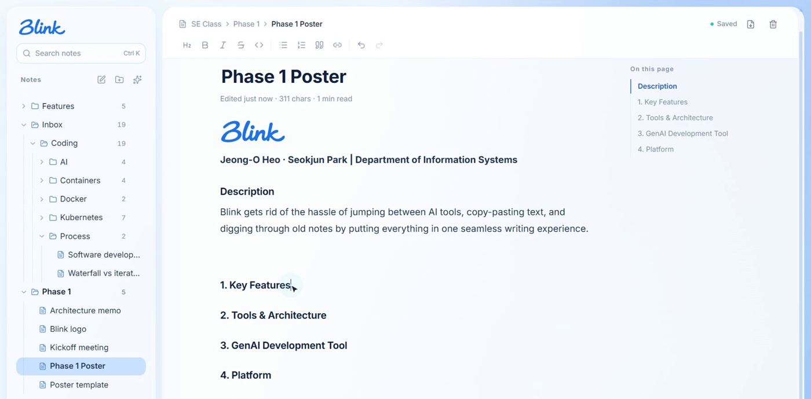
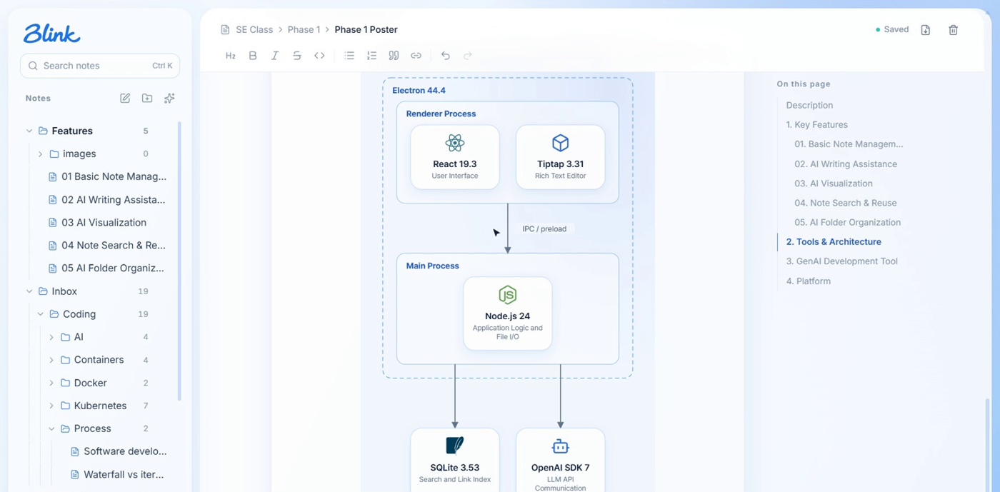
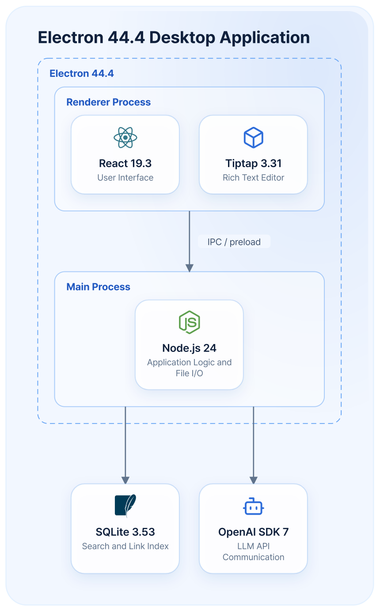

<div align="center">


**AI Note Organizer — a desktop note app where AI works right where you write**

Jeong-O Heo · Seokjun Park | Department of Information Systems


</div>

---

### Description

Blink eliminates the hassle of switching between AI tools, copying and pasting text, and searching through old notes by bringing everything into one seamless writing experience.



---

### 1. Key Features

#### 01. Basic Note Management (CRUD)

- Create, read, update, and delete Markdown notes.
- Manage notes and folders in a simple desktop editor.

#### 02. AI Writing Assistance

- **Organize:** Restructure rough notes into clear, organized writing.
- **Expand:** Enrich selected text with web-grounded explanations and sources.


#### 03. AI Visualization

- Transform selected text into diagrams and infographics.
- Edit layouts and export visualizations as PNG.



#### 04. Note Search & Reuse

- Search notes by title and content.
- Open, link, or import existing notes into the current document.
- Maintain bidirectional links between related notes.


#### 05. AI Folder Organization

- Automatically classify notes into relevant folders using AI.
- Preview and confirm the suggested folder structure.


---

### 2. Tools & Architecture

<table>
<tr>
<td width="46%" valign="top">

</td>
<td valign="top">

```text
Electron 44.4 — Desktop Application
├── Renderer Process
│   ├── React 19.3  — User Interface
│   └── Tiptap 3.31 — Rich Text Editor
│
│      ↓  IPC / Preload Bridge
│
└── Main Process
    └── Node.js 24  — Application Logic & File I/O

Main Process
├── SQLite 3.53   — Search & Link Index
└── OpenAI SDK 7  — LLM API Communication
```

The renderer never touches files itself: every request crosses the preload bridge to the main process, which owns the Markdown files, the search index and the AI calls.

</td>
</tr>
</table>

---

### 3. GenAI Development Tool

- Claude Code (Claude Opus 5.5)

### 4. Platform

- Desktop Application (Electron)
- Windows 11

---

<details>
<summary><b>Run it locally</b></summary>

Requires Node.js 24 and pnpm 11.

```bash
pnpm install
pnpm dev        # start the app with hot reload
pnpm test       # unit tests (Vitest)
pnpm typecheck
pnpm dist       # build the Windows installer
```

AI features need your own OpenAI or Kimi API key — open **Settings** in the app, pick a provider and a model, and paste the key.

</details>

<details>
<summary><b>Documentation</b></summary>

- [Overview](docs/00-overview.md) · [System context](docs/01-system-context.md) · [Architecture](docs/02-architecture.md)
- [Domain map](docs/03-domain-map.md) · [API conventions](docs/04-api-conventions.md) · [Cross-cutting concerns](docs/05-cross-cutting.md)
- [Feature notes](docs/features/) used in the demo poster

</details>
