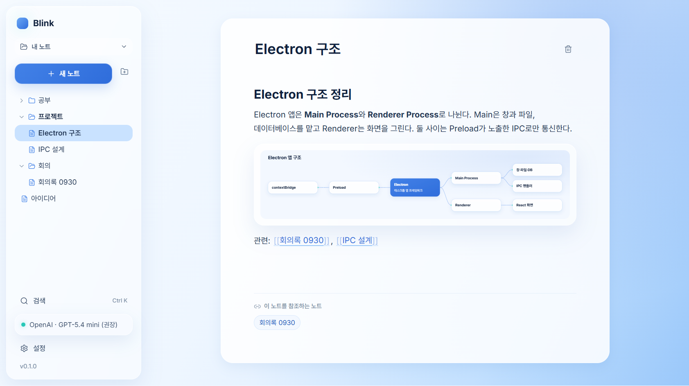
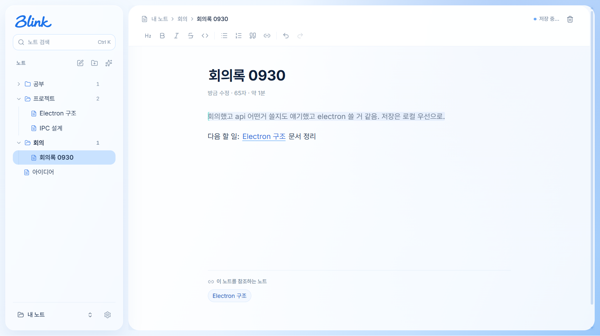
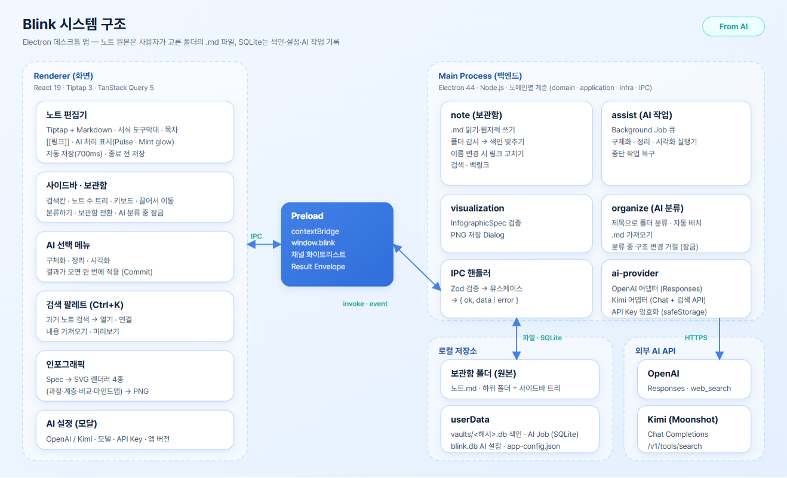

# Blink

> **고르고, 깜빡이면, 완성.**
>
> 창을 바꾸지도, 복사해 붙여넣지도 않습니다. 쓰던 문장을 고르면 그 자리가 **깜빡이며(Blink)** 더 나은 글로 바뀌고, 잊고 있던 예전 노트가 지금 쓰는 글과 이어집니다.

Blink의 바탕은 누구나 바로 쓸 수 있는 **간단한 메모·문서 도구**입니다.
새 노트를 만들고, 쓰고, 폴더로 정리하면 됩니다. 사용법을 따로 배우거나 복잡한 설정을 할 필요가 없습니다.

그 위에 글을 쓰다가 실제로 막히는 순간에 필요한 기능을 **지금 쓰고 있는 화면 안에** 더했습니다.

- 대충 적어 둔 메모를 제대로 된 글로 바꾸고 싶을 때
- 쓰다가 근거나 설명이 더 필요할 때
- 복잡한 내용을 그림으로 한눈에 보고 싶을 때
- 예전에 비슷한 걸 적어 둔 것 같을 때

## 1. 팀원

- 정보시스템학과 허정오
- 정보시스템학과 박석준

## 2. 한 문장 설명

> 간단한 메모·문서 도구에, 글을 쓰다 필요한 AI 도움과 과거 노트 활용을 흐름을 끊지 않고 쓸 수 있게 더한 데스크톱 노트 앱

**왜 만들었나**

지금 노트를 쓰다 AI의 도움을 받으려면 이런 과정을 거칩니다.

```text
노트 작성 → AI 서비스 열기 → 복사 → 프롬프트 작성 → 기다리기 → 결과 복사 → 노트로 돌아와 붙여넣기
```

한 번 AI를 쓸 때마다 쓰던 생각이 끊깁니다. 예전에 적어 둔 내용을 다시 쓰려면 파일을 하나하나 열어 찾아야 합니다. 노트가 특정 앱 안에 갇혀 있으면 다른 도구로 옮기기도 어렵습니다.

**Blink가 제공하려는 것**

| 목표                            | 사용자가 얻는 것                                                                                                                       |
| ------------------------------- | -------------------------------------------------------------------------------------------------------------------------------------- |
| **쓰던 자리에서 바로 AI 활용**  | 문장을 선택하고 버튼 하나만 누르면 됩니다. 복사·붙여넣기도, 다른 창도, 로딩 화면도 없습니다. AI가 일하는 동안에도 계속 쓸 수 있습니다. |
| **과거의 생각을 현재의 재료로** | 예전 노트를 쓰는 화면에서 바로 찾아 링크로 잇거나 내용을 가져옵니다. 노트가 쌓일수록 더 쓸모 있어집니다.                               |
| **내 노트는 내 것**             | 노트는 내가 고른 폴더에 평범한 Markdown(`.md`) 파일로 저장됩니다. 다른 앱에서도 열 수 있고, 백업·동기화도 내 방식대로 하면 됩니다.     |
| **내가 고른 AI**                | OpenAI 또는 Kimi 중에서 고르고, 내 API Key와 모델을 씁니다. AI 없이도 노트 앱으로는 온전히 동작합니다.                                 |

## 3. 주요 화면

### 화면 1. 폴더 보관함과 노트 편집 — 간단한 문서 도구 + 연결된 기록



왼쪽은 **내 폴더 구조가 그대로 보이는 사이드바**입니다. 폴더를 만들고 노트를 끌어다 옮기며 평소 파일 정리하듯 관리합니다. 오른쪽은 제목과 본문만 있는 **단순한 편집 화면**이며, 쓰는 즉시 자동 저장됩니다.

본문의 `[[회의록 0930]]` 같은 링크를 누르면 그 노트로 이동합니다. 아래의 "이 노트를 참조하는 노트"에서는 이 노트를 언급한 다른 노트를 거꾸로 따라갈 수 있습니다. 가운데 그림은 본문 일부를 AI로 **시각화**해 넣은 인포그래픽(마인드맵)입니다. 그림 역시 노트 안에 함께 저장됩니다.

### 화면 2. 선택 영역 AI 정리 — 흐름을 끊지 않는 AI



회의 중에 급히 적은 문장을 선택하고 `정리`를 누른 화면입니다. **로딩 창이 뜨지 않습니다.** 선택한 부분만 천천히 깜빡이며(Pulse) "지금 AI가 다듬는 중"임을 보여 줍니다.

그동안 사용자는 다른 줄을 계속 쓸 수 있습니다. 결과가 준비되면 그 자리가 한 번에 바뀌고 잠깐 Mint 빛으로 표시됩니다. 처리 중인 부분은 잠겨 있어 AI 결과와 내 입력이 섞이지 않습니다. 실패하면 원문이 그대로 남고 다시 시도할 수 있습니다.

## 4. 주요 기능

### 1) 쓰던 자리에서 바로 — 선택한 부분만 AI로 구체화 · 정리 · 시각화

**이럴 때**: 대충 적은 메모를 다듬고 싶거나, 설명이 부족한 문장에 근거를 더하고 싶거나, 복잡한 내용을 한눈에 보고 싶을 때

**Blink에서는**: 본문에서 원하는 부분만 선택하면 메뉴가 뜹니다. 노트 전체가 아니라 **내가 고른 부분만** 바뀝니다.

| 작업       | 하는 일                                                                                                                                          | 예시                                                                                                   |
| ---------- | ------------------------------------------------------------------------------------------------------------------------------------------------ | ------------------------------------------------------------------------------------------------------ |
| **정리**   | 뜻은 그대로 두고 읽기 좋은 구조(제목·목록)로 바꿉니다                                                                                            | "회의했고 api 어떤거 쓸지도 얘기했고…" → `## 회의 내용` + 항목 목록                                    |
| **구체화** | 웹에서 근거를 찾아 내용을 더 정확하고 풍부하게 다시 쓰고, **실제 출처 링크**를 끝에 붙입니다                                                     | "Electron은 데스크톱 앱 프레임워크다." → Chromium·Node.js 기반 설명 + 출처 5개                         |
| **시각화** | 글의 구조를 읽어 원문 아래에 **인포그래픽**을 넣습니다. 과정·계층·비교·마인드맵 중 알맞은 형태를 AI가 고르고, 디자인은 Blink가 일관되게 그립니다 | 처리 단계 설명 → 단계별 흐름도, "A vs B" → 나란히 비교표. PNG로 저장해 발표 자료에 바로 쓸 수 있습니다 |

AI 작업은 백그라운드에서 처리됩니다. 결과는 **성공했을 때만 한 번에** 적용되므로 반쯤 바뀐 글이 남지 않습니다. 작업 중에 다른 노트로 갔다 와도, 앱을 껐다 켜도 결과가 들어갈 자리를 기억합니다.

### 2) 과거의 생각을 현재의 재료로 — 노트 검색 · 연결 · 가져오기

**이럴 때**: "이거 전에 어디 적어 뒀는데…" 싶을 때, 지금 쓰는 글에 예전 노트를 근거로 붙이고 싶을 때

**Blink에서는**: 쓰던 화면에서 `Ctrl+K`를 누르면 제목과 본문을 함께 검색합니다. 검색어가 들어간 문장이 강조되어 보이므로 노트를 열어 보지 않아도 맞는 노트인지 알 수 있습니다. 찾은 노트로는 다음을 할 수 있습니다.

- **열기**: 그 노트로 이동합니다.
- **연결**: 지금 노트에 `[[노트 이름]]` 링크를 넣습니다. 상대 노트에는 "이 노트를 참조하는 노트"로 자동으로 보입니다.
- **내용 가져오기**: 노트 전체, 또는 미리보기에서 고른 부분만 지금 커서 위치로 가져옵니다.

노트 이름을 바꾸거나 다른 폴더로 옮겨도 그 노트를 가리키던 링크가 **자동으로 따라 고쳐져** 연결이 끊기지 않습니다. 링크 형식은 옵시디언(Obsidian)과 같아서 다른 Markdown 앱에서도 그대로 통합니다.

### 3) 내 노트는 내 것 — 내 폴더에 Markdown으로 저장되는 보관함

**이럴 때**: 앱을 바꾸거나 없어져도 노트를 잃고 싶지 않을 때, 이미 쓰던 노트 폴더를 그대로 쓰고 싶을 때

**Blink에서는**: 처음 실행할 때 노트를 둘 폴더를 고릅니다. 그 폴더가 곧 **보관함**입니다.

- 노트 하나 = `.md` 파일 하나, 사이드바의 폴더 = 실제 폴더입니다. 탐색기에서 보는 것과 앱에서 보는 것이 같습니다.
- 제목이 곧 파일 이름이고, 본문은 입력을 멈추면 자동 저장됩니다. 창을 닫기 직전에 친 글자까지 저장됩니다.
- 다른 앱에서 파일을 추가하거나 고치면 Blink에 바로 반영됩니다. 이미 가진 옵시디언 보관함도 그대로 열 수 있습니다.
- AI가 만든 결과(정리된 글, 출처, 인포그래픽)도 모두 이 `.md` 파일 안에 저장됩니다. 노트와 결과가 따로 흩어지지 않습니다.

## 5. 시스템 구조



사용한 기술들이 어떻게 연결되어 있는지 보여주는 구조도입니다. 구조의 각 결정은 앞의 목표에서 나왔습니다.

- **흐름을 끊지 않는다** → AI 작업은 Main Process의 **백그라운드 작업 큐**에서 처리합니다. 화면(Renderer)은 선택 영역을 잠그고 Pulse로 상태만 보여 주다가, 완료 신호가 오면 결과를 한 번에 적용합니다.
- **내 노트는 내 것** → 노트의 원본은 **보관함 폴더의 `.md` 파일**입니다. SQLite는 빠른 검색·링크 조회를 위한 색인과 AI 작업 기록, 설정만 담습니다. 색인은 파일에서 언제든 다시 만들 수 있습니다. 폴더 감시로 외부 변경을 따라갑니다.
- **내가 고른 AI** → `ai-provider`가 OpenAI(Responses API + 웹 검색)와 Kimi(Chat Completions + 공식 검색 API)를 같은 방식으로 감쌉니다. 다른 기능은 어떤 AI를 쓰는지 몰라도 됩니다. API Key는 OS 보안 저장소로 암호화해 보관합니다.
- **안전한 데스크톱 앱** → 화면(React·Tiptap)은 파일·DB·네트워크에 직접 접근하지 않습니다. Preload가 허용한 통로(IPC)로만 Main에 요청하고, Main은 모든 요청을 검증한 뒤 응답합니다.

> AI를 활용해 제작한 구조도입니다 (이미지 오른쪽 위 `From AI` 표시).

## 6. 개발 도구 및 기술 스택

| 구분         | 도구 / 기술                                                                                            | 버전                                             |
| ------------ | ------------------------------------------------------------------------------------------------------ | ------------------------------------------------ |
| AI 도구      | Claude Code                                                                                            | Claude Opus 5.5                                  |
| 개발 언어    | TypeScript                                                                                             | 6.0                                              |
| 프레임워크   | Electron / React / Tiptap                                                                              | 44.4 / 19.3 / 3.31                               |
| 데이터베이스 | SQLite (better-sqlite3 · Drizzle ORM) + Markdown 파일                                                  | SQLite 3.53 (better-sqlite3 13.0 · Drizzle 0.45) |
| 주요 도구    | Node.js · pnpm · electron-vite · Vitest · Playwright · electron-builder · OpenAI SDK(OpenAI·Kimi 호출) | 24(Electron 내장) · 11 · 5 · 5 · 1.63 · 26 · 7   |

## 7. 실행 환경

- 운영체제: Windows 11 (x64)
- 기타 실행 환경:
  - **설치**: `Blink-Setup-0.1.0.exe`를 실행해 설치한 뒤, 첫 화면에서 노트를 둘 폴더를 고르면 바로 쓸 수 있습니다.
  - **AI 기능 (선택)**: 인터넷 연결과 OpenAI 또는 Kimi(Moonshot) API Key가 필요합니다. `설정`에서 Provider·모델·Key를 입력하고 `연결 테스트` 후 저장합니다. 노트 작성·폴더 정리·검색·연결은 Key 없이도 모두 됩니다.
    - Kimi는 `kimi-k2.6`(권장)과 `kimi-k3`로 실제 API 테스트를 마쳤습니다.
    - 중국 계정이면 Base URL에 `https://api.moonshot.cn/v1`을 입력합니다.
  - **소스에서 실행**: Node.js 22 이상, pnpm 11 환경에서 `pnpm install` → `pnpm dev`. 설치 파일은 `pnpm dist`로 만들며 `dist/`에 생성됩니다.
  - **테스트**:
    - `pnpm test`: 단위·화면 흐름
    - `pnpm test:e2e`: 실제 Electron 앱으로 명세서 시나리오 1~8
    - `pnpm verify:packaged`: 설치본 실행 확인
