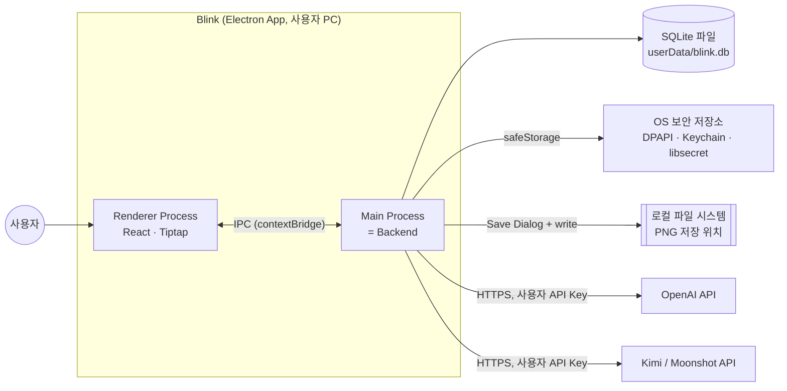

# 01. System Context

Blink는 서버가 없는 단일 데스크톱 애플리케이션이다. 외부와의 경계는 아래가 전부다.

## 외부 시스템

| 시스템 | 용도 | 누가 호출 | 실패 시 |
| --- | --- | --- | --- |
| OpenAI API | 텍스트 생성, Structured Output, Native Web Search | Main (`ai-provider` 어댑터) | Job `FAILED` + 오류 코드. 원문 유지. |
| Kimi(Moonshot) API | 동일 (Phase 1 후반, 명세서 §38 Step 14) | Main | 동일 |
| OS 보안 저장소 | API Key 암·복호화 키 (`safeStorage`) | Main | Key 저장 거부 (D-08) |
| SQLite 파일 | 모든 앱 데이터 | Main | 앱 시작 실패 → 오류 화면 |
| 로컬 파일 시스템 | 인포그래픽 PNG 저장 | Main (`dialog` + `fs`) | 저장 실패 오류 반환 |

## 데이터가 외부로 나가는 경우

사용자가 AI 작업을 요청할 때 **선택한 텍스트만** 사용자가 설정한 Provider로 전송된다. 노트 전체, 다른 노트, API Key 이외의 설정은 전송하지 않는다. 텔레메트리는 없다.

## 없는 것

- 백엔드 서버, 사용자 계정/인증, 클라우드 동기화
- 메시지 브로커, 외부 스토리지
- 이미지 생성 모델 (시각화는 SVG를 직접 렌더링, 명세서 §15)
