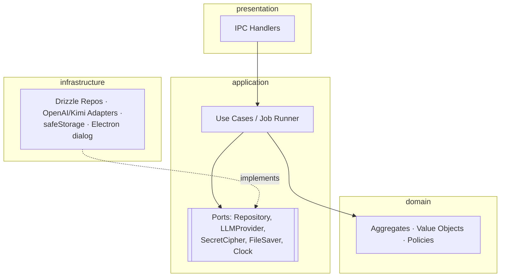
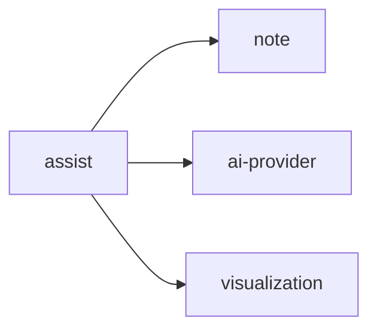

# 02. Architecture

## 프로세스 구조

```text
┌──────────────────────── Renderer (untrusted) ────────────────────────┐
│ React UI · Tiptap Editor · Pending Mark / Selection Lock ·           │
│ Infographic SVG Renderer · Canvas PNG 래스터화                        │
│                                                                      │
│ 노트 본문(ProseMirror doc)의 유일한 작성자 (D-04)                      │
└───────────────────────────────┬──────────────────────────────────────┘
                                │ window.blink.*  (preload, contextBridge)
┌───────────────────────────────▼──────────────────────────────────────┐
│ Preload: 채널 화이트리스트, Result Envelope를 그대로 전달              │
└───────────────────────────────┬──────────────────────────────────────┘
                                │ ipcRenderer.invoke / webContents.send
┌───────────────────────────────▼──────── Main (= Backend) ────────────┐
│ presentation  IPC handlers: 입력 Zod 검증 → 유스케이스 호출 → Envelope│
│ application   유스케이스, Job Runner, 포트(인터페이스)                 │
│ domain        Note, AIJob, AIProviderSettings, InfographicSpec        │
│ infrastructure Drizzle/SQLite, OpenAI/Kimi 어댑터, safeStorage, dialog │
└──────────────────────────────────────────────────────────────────────┘
```

- **Renderer는 신뢰하지 않는다.** 모든 IPC 입력은 Main에서 다시 검증한다. Renderer의 버튼 비활성화(예: 구체화 🔒)는 UX일 뿐, 규칙은 Main이 강제한다.
- AI 호출은 네트워크 I/O이므로 Main 이벤트 루프에서 비동기로 실행한다. 별도 `utilityProcess`/Worker는 Phase 1에서 불필요하다.
- SQLite 드라이버는 동기식 `better-sqlite3`를 사용한다. 쿼리가 짧아 이벤트 루프 차단이 무시할 수준이고, 트랜잭션이 단순해진다.

## 레이어 책임 (Main 내부)

| 레이어 | 책임 | 의존 가능 대상 |
| --- | --- | --- |
| presentation | IPC 채널 등록, 전송 검증(Zod), 유스케이스 호출, 도메인 오류 → Envelope 매핑, 푸시 이벤트 송신 | application |
| application | 유스케이스 오케스트레이션(load → 도메인 행위 → save → 부수효과), 트랜잭션 경계, 포트 정의 | domain, 다른 도메인의 application 공개 API |
| domain | 비즈니스 규칙, 불변식, 상태 전이. 순수 TypeScript | 없음 (Zod 등 순수 라이브러리만 허용) |
| infrastructure | 포트 구현: Repository(Drizzle), LLM 어댑터, SecretCipher(safeStorage), FileSaver(dialog+fs), Clock, IdGenerator | application·domain의 인터페이스 |

도메인 코드에서 `electron`, `drizzle-orm`, `better-sqlite3`, `openai` SDK를 import하면 설계 위반이다.

## 의존 방향



## 도메인 간 의존



- 의존은 **상대 도메인의 application 공개 API** 또는 **도메인 값 객체**로만 한다. 다른 도메인의 Repository·테이블을 직접 조회하지 않는다.
- `note`, `ai-provider`, `visualization`은 다른 도메인에 의존하지 않는다.
- 예외: 노트 삭제 시 AI Job 정리는 DB의 `ON DELETE CASCADE`에 맡긴다(단일 로컬 DB이므로 허용, [assist/cross-cutting.md](backend/assist/cross-cutting.md)).

## 소스 구조

```text
src/
├─ main/
│  ├─ bootstrap.ts              # Composition Root: DB 열기 → 마이그레이션 → 의존성 조립 → IPC 등록 → 중단 Job 정리
│  ├─ platform/                 # 도메인 무관 기술 요소
│  │  ├─ db/                    # connection(PRAGMA), drizzle schema, migrations
│  │  ├─ ipc/                   # handle() 헬퍼, Envelope, 오류 매핑, sender 검증
│  │  └─ clock.ts, id.ts
│  ├─ note/
│  │  ├─ domain/                # Note, NoteContent, NoteTitle, SearchQuery, NoteRepository(interface)
│  │  ├─ application/           # NoteService(유스케이스), NoteQueries(타 도메인 공개 API)
│  │  ├─ infrastructure/        # DrizzleNoteRepository
│  │  └─ presentation/          # note.ipc.ts
│  ├─ assist/
│  │  ├─ domain/                # AIJob, JobType, JobResult, 오류 코드, AIJobRepository(interface)
│  │  ├─ application/           # CreateAIJob, RetryAIJob, AIJobQueries, JobRunner, executors/, prompts/
│  │  ├─ infrastructure/        # DrizzleAIJobRepository
│  │  └─ presentation/          # ai.ipc.ts, job-event-publisher.ts
│  ├─ ai-provider/
│  │  ├─ domain/                # AIProviderSettings, ProviderSetting, ModelCapabilities, ModelCatalog
│  │  ├─ application/           # ProviderSettingsService, ActiveLLM(타 도메인 공개 API), ports(LLMProvider, SecretCipher)
│  │  ├─ infrastructure/        # openai.provider.ts, kimi.provider.ts, safe-storage.cipher.ts, Drizzle repo
│  │  └─ presentation/          # settings.ipc.ts
│  └─ visualization/            # InfographicSpec 자체는 src/shared/visualization (Shared Kernel)
│     ├─ application/           # ExportInfographicPng, ports(FileSaver)
│     ├─ infrastructure/        # electron-dialog.file-saver.ts
│     └─ presentation/          # visualization.ipc.ts
├─ preload/
│  └─ index.ts                  # window.blink 노출
├─ shared/                      # Main·Preload·Renderer 공용 (순수 TS)
│  ├─ ipc/                      # 채널 이름, 요청/응답 타입, Zod 스키마, BlinkErrorCode
│  └─ visualization/            # InfographicSpec 도메인 코드(Zod 형식 + 구조 불변식 + 정규화).
│                               # Main(결과 검증)과 Renderer(저장된 Spec 로드)가 같은 규칙을 쓰는 Shared Kernel
└─ renderer/                    # frontend-design에서 설계
```

명세서 §37의 `main/ipc`, `main/jobs`, `main/ai` 기술 기준 폴더 대신 **도메인 기준 폴더**를 사용한다. 기능 추가 시 수정 범위가 한 도메인 폴더로 모인다.

## 의존성 조립

DI 프레임워크를 쓰지 않는다. `bootstrap.ts`에서 생성자 주입으로 직접 조립한다. 테스트에서는 같은 생성자에 In-memory Repository / Fake LLMProvider를 넣는다.

## 앱 시작 순서

```text
app.whenReady
→ DB 열기 (PRAGMA foreign_keys=ON, journal_mode=WAL)
→ 마이그레이션 적용
→ 의존성 조립
→ 중단된 AI Job 정리 (UC-ASSIST-006)
→ IPC 핸들러 등록
→ BrowserWindow 생성
```

IPC 핸들러는 창 생성 **전에** 등록해 Renderer의 첫 호출이 유실되지 않게 한다.

## 앱 종료 순서

```text
창 close
→ preventDefault, app:will-close 발행
→ Renderer가 대기 중 자동 저장 flush → app:ready-to-close   (최대 3초)
→ 창 닫기
→ before-quit: Job Runner는 기다리지 않는다 (실행 중 Job은 다음 시작 시 INTERRUPTED)
→ DB close
```
