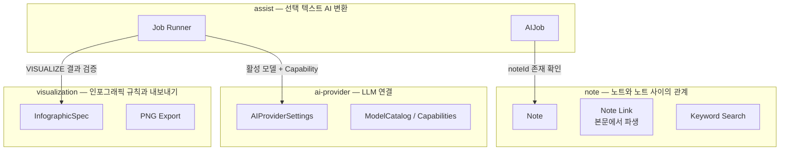

# 03. Domain Map

## 도메인별 책임

| 도메인 | 소유 | 소유하지 않음 |
| --- | --- | --- |
| **note** | 노트 생명주기, 제목/본문 규칙, 본문 파생 데이터(plainText, 링크 집합), 키워드 검색, 링크/백링크 조회 | AI 결과 생성, 편집기 UI 동작 |
| **assist** | AI Job 생명주기(요청·실행·완료·실패·재시도), Job 유형별 Capability 요구, 결과 검증, 적용(Commit) 프로토콜 | 노트 본문 쓰기(Renderer 소유, D-04), Provider 설정, 인포그래픽 구조 규칙 |
| **ai-provider** | Provider별 설정, 활성 Provider, API Key 암호화 보관, 모델 카탈로그와 Capability, 연결 테스트, LLM 어댑터 | 프롬프트 내용, Job 상태 |
| **visualization** | InfographicSpec 구조 규칙(유형별 불변식, 정규화), PNG 파일 저장 | Spec 생성(assist), SVG 레이아웃·디자인 시스템(Renderer) |

## 핵심 개념의 소유자

| 개념 | 소유 도메인 | 비고 |
| --- | --- | --- |
| Note, NoteContent, NoteTitle | note | |
| NoteLink | note | Note 애그리거트의 파생 상태 (D-02) |
| AIJob, JobType, JobStatus, JobFailure | assist | |
| Pending Mark 규약 | assist | 편집기 구현은 Renderer, 의미와 규칙은 assist |
| ModelCapabilities | ai-provider | assist는 요구 Capability를 JobType에 정의하고 비교만 한다 |
| API Key | ai-provider | Main 밖으로 나가지 않음 |
| InfographicSpec | visualization | 스키마는 `src/shared`에 두어 Renderer와 공유 |

## 새 기능 배치 가이드

| 향후 기능 (명세서 §40) | 배치 |
| --- | --- |
| 의미 검색(Embedding) | note (검색 전략 확장). 임베딩 생성에 LLM이 필요하면 ai-provider 포트 사용 |
| Gemini / OpenRouter / Local LLM | ai-provider 어댑터 추가만 |
| AI 결과 버전 기록 | assist |
| 폴더 / Notebook | note (별도 생명주기가 커지면 그때 분리 검토) |
| Custom Prompt | assist |
| 시각화 테마 | Renderer 디자인 시스템 (visualization 도메인 변경 없음) |
