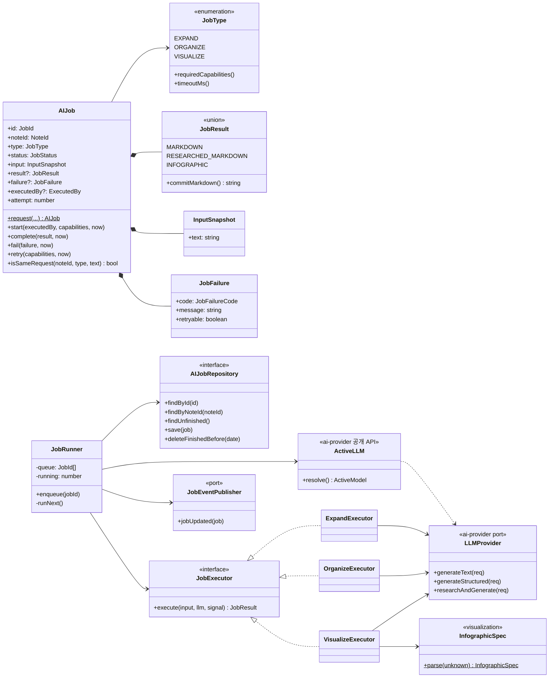

# Assist Domain — Class Diagram

도메인 객체와, 유형별 파이프라인(Executor)이 어떤 포트에 의존하는지를 보여준다.

## 책임 분리

| 클래스 | 책임 | 하지 않는 것 |
| --- | --- | --- |
| `AIJob` | 상태 전이, 결과·실패의 형식 보장 | I/O, 타이머 |
| `JobExecutor` (유형별) | 프롬프트 구성, Provider 호출, 원시 응답 → `JobResult` 변환 | 상태 전이, 저장 |
| `JobRunner` | 큐, 동시 실행 상한, 제한 시간, `start → execute → complete/fail → save → publish` | 프롬프트, 결과 해석 |
| `JobEventPublisher` | 상태 변경을 Renderer에 푸시 | |

Executor를 유형별로 나눈 이유: 세 파이프라인은 필요한 Capability, 프롬프트, 검증이 모두 다르다(명세서 §13~§15). 하나의 서비스에 `switch`로 넣으면 유형 추가 시 전체를 수정해야 한다.
