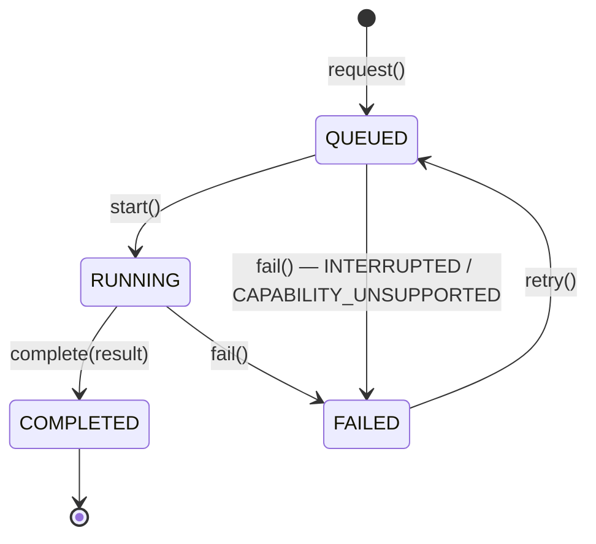

# Assist Domain — Domain Model

## Aggregate: AIJob

| 항목 | 내용 |
| --- | --- |
| Responsibility | AI 변환 1건의 상태 전이와, 유형에 맞는 검증된 결과만 보유하는 것 |
| State | `id`, `noteId`, `type: JobType`, `status: JobStatus`, `input: InputSnapshot`, `result?: JobResult`, `failure?: JobFailure`, `executedBy?: { provider, model }`, `attempt`, `createdAt`, `startedAt?`, `completedAt?` |
| Invariants | 아래 표 |
| Lifecycle | 상태 다이어그램 참조 |

### 행위

| 메서드 | 전이 | 규칙 |
| --- | --- | --- |
| `AIJob.request(id, noteId, type, input, capabilities, now)` | → `QUEUED` | BR-ASSIST-01(입력은 `InputSnapshot`이 검증), BR-ASSIST-02 |
| `start(executedBy, capabilities, now)` | `QUEUED` → `RUNNING` | 시작 시점 Capability 재검사(부족하면 거절). Runner는 먼저 확인하고 부족하면 `start` 대신 `fail(CAPABILITY_UNSUPPORTED)`를 호출한다 |
| `complete(result, now)` | `RUNNING` → `COMPLETED` | `result`의 종류가 `type`과 맞아야 함 (EXPAND ↔ 출처가 있는 Markdown, ORGANIZE ↔ Markdown, VISUALIZE ↔ Infographic) |
| `fail(failure, now)` | `QUEUED`/`RUNNING` → `FAILED` | |
| `retry(capabilities, now)` | `FAILED` → `QUEUED` | BR-ASSIST-05. `attempt + 1`, `result`/`failure`/`startedAt`/`completedAt`/`executedBy` 초기화 |
| `isSameRequest(noteId, type, inputText)` | — | 멱등 요청 판별 |

잘못된 전이는 `AI_JOB_NOT_RETRYABLE`(retry) 또는 내부 오류(`IllegalJobTransition`, 프로그래밍 오류)로 거절한다.

### 불변식

| 상태 | `result` | `failure` | `startedAt` | `completedAt` |
| --- | --- | --- | --- | --- |
| `QUEUED` | 없음 | 없음 | 없음 | 없음 |
| `RUNNING` | 없음 | 없음 | 있음 | 없음 |
| `COMPLETED` | **있음** | 없음 | 있음 | 있음 |
| `FAILED` | 없음 | **있음** | 선택 | 있음 |

`COMPLETED`이면 항상 검증된 결과가 있다 — Renderer가 `COMPLETED`만 보고 안심하고 적용할 수 있는 근거다.

### 상태 다이어그램



명세서 §11.2의 상태에 `QUEUED → FAILED`(중단·Capability 상실)와 `FAILED → QUEUED`(재시도)를 추가했다.

## Value Objects

### JobType

```ts
enum JobType { EXPAND, ORGANIZE, VISUALIZE }
JobType.requiredCapabilities(type): Capability[]   // BR-ASSIST-02
JobType.timeoutMs(type): number                    // BR-ASSIST-07
```

Capability 요구는 **JobType이 안다**(무엇이 필요한지는 작업의 성질). 모델이 무엇을 지원하는지는 ai-provider의 `ModelCapabilities`가 안다. 비교는 `capabilities.supportsAll(JobType.requiredCapabilities(type))`.

### InputSnapshot

- `text`: 공백 제외 1자 이상, 최대 10,000자 (BR-ASSIST-01).
- 요청 시점에 고정. 실행·재시도 모두 이 값만 사용한다.

### JobResult (유형별 합 타입)

```ts
type JobResult =
  | { kind: 'MARKDOWN'; markdown: string }                                  // ORGANIZE
  | { kind: 'RESEARCHED_MARKDOWN'; markdown: string; sources: Source[] }    // EXPAND
  | { kind: 'INFOGRAPHIC'; spec: InfographicSpec };                         // VISUALIZE

type Source = { title: string; url: string };   // url은 http(s)
```

생성 팩토리가 BR-ASSIST-03, 04를 강제한다.

- `JobResult.markdown(raw)` — 코드 펜스 제거, 길이 검증.
- `JobResult.researched(raw, sources)` — 위 + 출처 정규화(http(s)만, URL 중복 제거, 최대 5건), 0건이면 `NO_SOURCES`.
- `JobResult.infographic(spec)` — `spec`은 이미 visualization 도메인에서 검증된 `InfographicSpec`.
- `commitMarkdown()` — Renderer가 적용할 최종 Markdown. RESEARCHED_MARKDOWN은 본문 + `\n\n**출처**\n- [title](url)…`.

### JobFailure

```ts
type JobFailure = { code: JobFailureCode; message: string; retryable: boolean };

type JobFailureCode =
  | 'PROVIDER_NOT_CONFIGURED'  // 실행 시점에 활성 Provider/API Key 없음
  | 'PROVIDER_AUTH_FAILED'     // 401/403 — API Key 확인 필요
  | 'PROVIDER_RATE_LIMITED'    // 429
  | 'PROVIDER_UNAVAILABLE'     // 네트워크, 5xx
  | 'TIMEOUT'
  | 'INVALID_OUTPUT'           // 결과 형식/Spec 검증 실패
  | 'NO_SOURCES'               // EXPAND 출처 없음
  | 'CAPABILITY_UNSUPPORTED'   // 실행 시점에 모델이 기능 미지원
  | 'INTERRUPTED'              // 앱 종료로 중단
  | 'UNKNOWN';
```

`message`는 진단용이며 API Key·원문을 포함하지 않는다. 사용자 문구는 Renderer가 `code`로 결정한다. `retryable`은 UI 힌트일 뿐, 재시도 자체는 모든 `FAILED`에서 허용한다(사용자가 설정을 고친 뒤 재시도할 수 있으므로).

## Pending Mark 규약

Assist가 정의하고 Renderer가 구현하는 본문 규약이다.

```ts
// Mark
{ type: 'aiPending', attrs: { jobId: string } }
```

| 규칙 | 내용 |
| --- | --- |
| 생성 | `ai:create-job` 호출 직전, 선택 범위 전체에 적용 |
| 잠금 | Mark 범위를 변경하는 트랜잭션은 거부 (Selection Lock). Undo도 포함. 단, Commit 트랜잭션과 Mark 제거는 허용 |
| 저장 | 본문과 함께 자동 저장된다 → 노트 전환·재시작 후에도 유지 |
| 유효성 | 같은 노트의 Job을 가리킬 때만 유효 (BR-ASSIST-06) |
| 제거 | Commit 완료, 적용 불가(BR-ASSIST-08), 실패 후 사용자가 닫기, Job 없음 |

## Object Diagram — 노트 전환 중 완료

Mark 기반 앵커가 필요한 이유를 보여준다.

```text
t0  Note A 편집 중, "회의했고 api 어떤거…" 선택 → 정리
      Note A.content: … [aiPending jobId=J1]회의했고 api 어떤거…[/aiPending] …
      AIJob J1 { noteId: A, type: ORGANIZE, status: QUEUED, input: "회의했고 api 어떤거…" }

t1  사용자가 Note B로 이동. A는 자동 저장(Mark 포함)된 상태
      AIJob J1 { status: RUNNING, executedBy: openai/gpt-… }

t2  J1 완료 → ai:job-updated(J1, COMPLETED). 편집기에는 B가 열려 있어 J1 Mark 없음 → 무시
      AIJob J1 { status: COMPLETED, result: MARKDOWN("## 프로젝트 회의 결과 …") }

t3  사용자가 A로 복귀 → UC-ASSIST-005
      Mark J1 발견 → ai:list-jobs(A) → J1 COMPLETED
      Mark 범위 텍스트 == input  → 교체 + Mark 제거 → 자동 저장
```

위치 숫자(`selectionFrom/To`)였다면 t1~t3 사이 A의 다른 부분 편집만으로 위치가 어긋난다.
