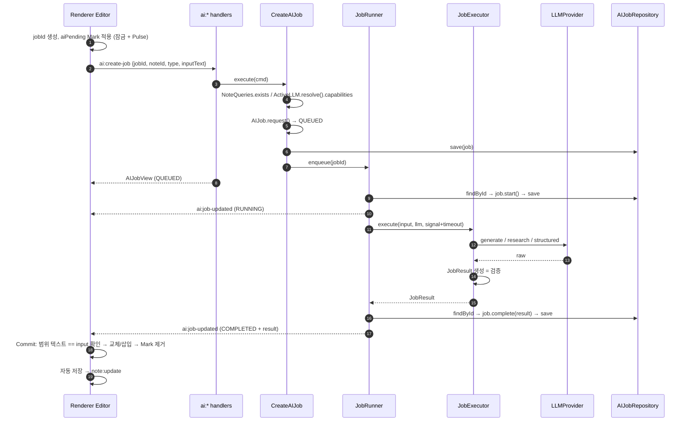

# Assist Domain — Application Flows

## 전체 흐름



---

## UC-ASSIST-001 CreateAIJob

```text
ai:create-job handler (Zod: jobId UUID, noteId UUID, type enum, inputText string)
→ CreateAIJob.execute(cmd)
   → existing = repo.findById(cmd.jobId)
       if existing:
         existing.isSameRequest(...) ? return view(existing) : throw AI_JOB_ID_CONFLICT
   → noteQueries.exists(noteId)            else NOTE_NOT_FOUND
   → active = activeLLM.resolve()          else AI_PROVIDER_NOT_CONFIGURED
   → job = AIJob.request(jobId, noteId, type, InputSnapshot.of(inputText), active.capabilities, now)
                                           // AI_INPUT_EMPTY / AI_INPUT_TOO_LONG / AI_CAPABILITY_UNSUPPORTED
   → repo.save(job)
   → runner.enqueue(job.id)
→ AIJobView
```

## UC-ASSIST-002 JobRunner

```text
enqueue(jobId): queue.push(jobId); runNext()

runNext():
  while running < MAX_CONCURRENCY(2) && queue not empty:
    jobId = queue.shift(); running++
    run(jobId).finally(() => { running--; runNext() })

run(jobId):
  job = repo.findById(jobId);  if !job || job.status != QUEUED → return

  active = activeLLM.tryResolve()          // 요청 후 설정이 지워졌거나 바뀌었을 수 있다
  if !active:                               job.fail(PROVIDER_NOT_CONFIGURED); save; publish; return
  if !active.capabilities.supportsAll(job.type.required):
                                            job.fail(CAPABILITY_UNSUPPORTED);  save; publish; return

  job.start({provider, model}, active.capabilities, now); save; publish

  try:
      result = await withTimeout(executors[job.type].execute(job.input, active.client, signal),
                                 job.type.timeoutMs)            // DB 트랜잭션 밖
      outcome = (j) => j.complete(result, now)
  catch err:
      outcome = (j) => j.fail(FailureMapper.from(err), now)

  current = repo.findById(jobId)          // 실행 중 노트 삭제 → cascade로 사라졌을 수 있음
  if !current: return                     // 결과 폐기
  outcome(current); save; publish
```

- 완료 시 `findById`를 **다시** 하는 이유: 긴 LLM 호출 동안 노트(와 Job)가 삭제될 수 있다. 메모리의 오래된 객체를 저장하면 삭제된 행을 되살리거나 FK 오류가 난다.
- `FailureMapper`는 Provider 어댑터가 던지는 `ProviderError(kind)`와 `TimeoutError`, `InfographicSpecError`, `JobResultError`를 `JobFailureCode`로 변환한다. 그 외는 `UNKNOWN` + 로그.

### 유형별 Executor

| Executor | Provider 호출 | 결과 생성 |
| --- | --- | --- |
| `OrganizeExecutor` | `generateText({ system: ORGANIZE_PROMPT, user: input })` | `JobResult.markdown(text)` |
| `ExpandExecutor` | `researchAndGenerate({ system: EXPAND_PROMPT, user: input })` → `{ text, sources }` | `JobResult.researched(text, sources)` |
| `VisualizeExecutor` | `generateStructured({ system: VISUALIZE_PROMPT, user: input, schema: infographicJsonSchema })` | `InfographicSpec.parse(raw)` → `JobResult.infographic(spec)` |

프롬프트(`application/prompts/*.ts`)는 코드 상수로 관리한다. 공통 지시: 입력 언어로 답한다, 입력에 없는 사실을 만들지 않는다(ORGANIZE), 설명 없이 결과만 출력한다.

## UC-ASSIST-003 Commit Protocol (Renderer)

Main은 관여하지 않지만 Atomic 요구사항(명세서 §12)의 절반이므로 여기서 정의한다.

```text
onJobCompleted(job):
  range = findMarkRange(editor, job.id)
  if !range: return                                   // 이 노트가 열려 있지 않음 → 나중에 UC-ASSIST-005

  tr = editor.state.tr   // 하나의 트랜잭션
  if selectionText(range) != job.inputText:           // BR-ASSIST-08 (요청 때와 같은 함수로 읽는다)
      tr.removeMark(range, aiPending); dispatch; notify('원문이 바뀌어 적용하지 않았습니다'); return

  switch job.type:
    EXPAND | ORGANIZE:
      nodes = markdownToNodes(job.result.markdown)    // 편집기 스키마로 파싱, HTML 삽입 금지
      tr.replaceWith(range.from, range.to, nodes)     // Mark도 함께 사라짐
    VISUALIZE:
      tr.removeMark(range, aiPending)
      tr.insert(endOfBlock(range.to), infographicNode({ spec: job.result.spec }))
  tr.setMeta('aiCommit', true)                        // Selection Lock 통과 표식
  dispatch(tr)                                        // 자동 저장 트리거
```

## UC-ASSIST-004 RetryAIJob

```text
ai:retry-job handler
→ RetryAIJob.execute({ jobId })
   → job = repo.findById(jobId)        else AI_JOB_NOT_FOUND
   → active = activeLLM.resolve()      else AI_PROVIDER_NOT_CONFIGURED
   → job.retry(active.capabilities, now)   // AI_JOB_NOT_RETRYABLE / AI_CAPABILITY_UNSUPPORTED
   → repo.save(job); runner.enqueue(job.id); publish(job)
→ AIJobView
```

## UC-ASSIST-005 List Jobs (노트 열기)

```text
ai:list-jobs handler
→ AIJobQueries.listByNote(noteId)  → AIJobView[]   (createdAt DESC)
```

Renderer의 Mark 해석 규칙은 [use-cases.md](use-cases.md#uc-assist-005-노트를-열-때-보류-작업-복원).

## UC-ASSIST-006 Startup Recovery

```text
bootstrap → RecoverInterruptedJobs.execute()
   → for job in repo.findUnfinished(): job.fail(INTERRUPTED, now); repo.save(job)
   → repo.deleteFinishedBefore(now - 30d)
```

IPC 등록·창 생성 전에 실행하므로 Renderer가 중간 상태를 볼 일이 없다.

## 이벤트 발행

`JobEventPublisher.jobUpdated(job)` → 모든 `BrowserWindow`의 `webContents.send('ai:job-updated', AIJobView)`. 상태가 바뀔 때마다(QUEUED(재시도), RUNNING, COMPLETED, FAILED) 발행한다. Renderer는 이벤트를 놓쳐도 노트를 열 때 `ai:list-jobs`로 복구하므로 이벤트는 **최적화이지 정합성의 근거가 아니다.**
