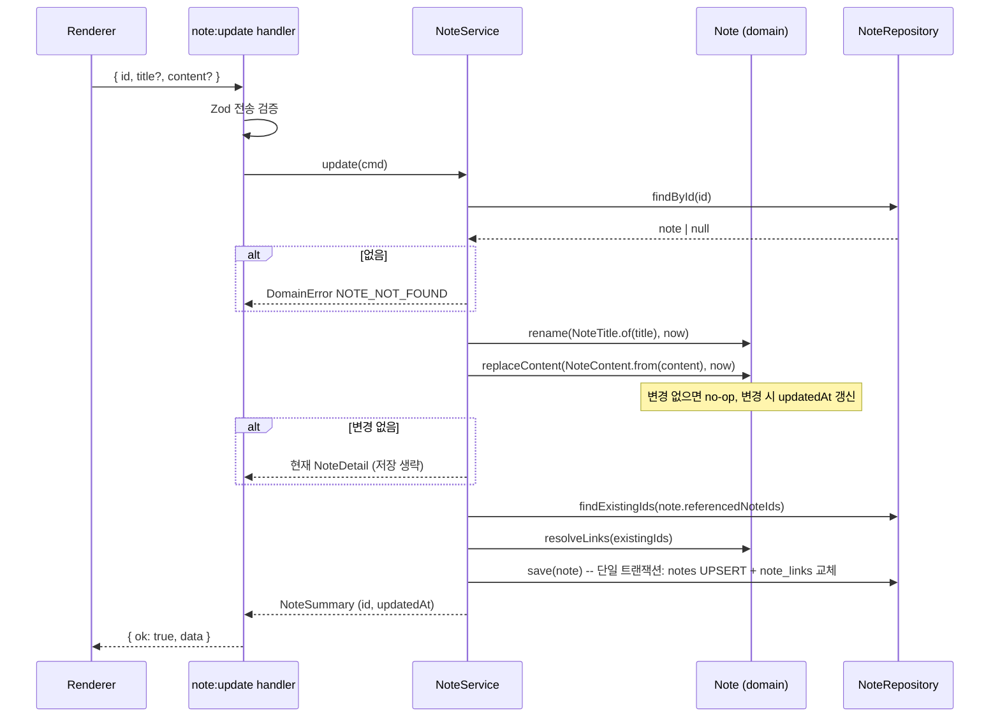

# Note Domain — Application Flows

note는 행위가 작고 응집되어 있어 **단일 애플리케이션 서비스 `NoteService`** 로 둔다. 다른 도메인에 공개하는 조회는 `NoteQueries`로 분리한다.

## UC-NOTE-001 Create

```text
note:create handler (Zod)
→ NoteService.create({ title?, content? })
   → NoteTitle.of(title ?? '')
   → content ? NoteContent.from(content) : NoteContent.empty()
   → Note.create(ids.next(), title, content, clock.now())
   → existing = repo.findExistingIds(note.referencedNoteIds)
   → note.resolveLinks(existing)
   → repo.save(note)
→ NoteDetail
```

생성 시 본문을 받는 이유: "새 노트로 가져오기" 등 향후 흐름을 위해. Phase 1 UI는 빈 노트만 만든다.

## UC-NOTE-004 Save (자동 저장)



`note:update` 응답은 전체 본문이 아니라 요약만 반환한다(자동 저장마다 큰 JSON 왕복 방지).

## UC-NOTE-005 Delete

```text
note:delete handler
→ NoteService.delete(id)
   → repo.delete(id)          -- 없으면 no-op
   -- FK cascade: note_links(양방향), ai_jobs
→ { deleted: true }
```

실행 중인 AI Job이 있으면 Runner가 완료 시점에 Job이 사라진 것을 발견하고 결과를 버린다([assist/cross-cutting.md](../assist/cross-cutting.md)).

## UC-NOTE-006 Search

```text
note:search handler
→ NoteService.search({ query, excludeNoteId?, limit })
   → q = SearchQuery.parse(query); if q.isEmpty() → []
   → notes = repo.search(q, { excludeNoteId, limit })   -- SQL: 후보 필터 + 정렬
   → notes.map(n => ({ id, title: n.displayTitle(), snippet: n.snippetFor(q.keywords), updatedAt }))
```

## UC-NOTE-008 List Links

```text
note-link:list handler
→ NoteService.listLinks(noteId)
   → repo.exists(noteId) else NOTE_NOT_FOUND
   → outgoing = repo.findOutgoingLinks(noteId)   -- 대상 id + 현재 제목
   → incoming = repo.findIncomingLinks(noteId)   -- 출발 id + 현재 제목
```

## 타 도메인 공개 API: NoteQueries

```ts
interface NoteQueries {
  exists(noteId: NoteId): boolean;   // assist가 Job 생성 시 사용
}
```
