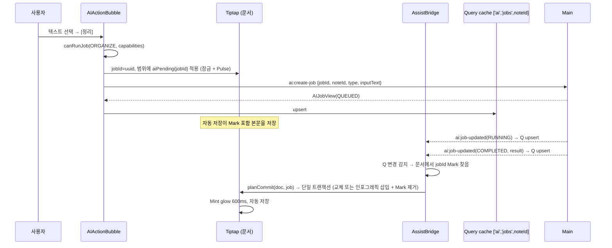

# Frontend — Data Flow

각 흐름은 **Data Source → Owner → Consumer → Mutation → Post-Mutation Update** 를 명시한다.

## 1. 노트 열기 · 자동 저장

```text
route #/notes/:id
→ useNoteDetail(id)                       Source: note:get
→ NoteEditor(key=id) 생성, 초기 content 주입   Owner: Tiptap 인스턴스
→ 사용자 입력 / 제목 입력
→ SaveQueue(id).markDirty()               status: dirty
→ 700ms debounce
→ SaveQueue.flush()
     저장 중이면 "다시 저장 필요" 표시만 하고 대기 (요청 직렬화)
     note:update { id, title, content: editor.getJSON() }
→ 성공: status saved, invalidate ['notes','list'], ['notes','links']
  실패: status error (다음 입력 또는 재시도 버튼에서 재시도)
```

- **SaveQueue는 React 밖의 `AutosaveRegistry`에 산다.** 다른 노트로 이동해 `NoteEditor`가 unmount되어도 대기 중인 저장이 끝까지 실행된다. unmount 시 `flush()`만 호출한다.
- 제목과 본문은 항상 함께 보낸다(요청 하나, 백엔드는 변경 없으면 저장 생략).
- 상세 쿼리는 갱신하지 않는다 — 편집기가 진실이다 ([state-model.md](state-model.md#편집기-문서-원본-renderer)).

### 앱 종료 시

```text
사용자가 창 닫기
→ Main: close 이벤트 preventDefault, app:will-close 발행
→ Renderer(AppShell): AutosaveRegistry.flushAll() 완료 대기
→ app:ready-to-close 호출
→ Main: 창 닫기 (3초 안에 응답이 없으면 그냥 닫음)
```

명세서 Scenario 1(작성 → 종료 → 재실행 → 유지)이 debounce 구간에서도 성립하도록 하는 흐름이다. 채널 정의는 [04-api-conventions.md](../04-api-conventions.md#앱-수명주기-채널).

## 2. AI 작업 요청 → 완료 → Commit



| 항목 | 값 |
| --- | --- |
| Data Source | `ai:list-jobs`(노트 열 때), `ai:job-updated`(이후) |
| State Owner | Query cache `['ai','jobs',noteId]` — 이벤트 구독자 `useJobEvents`는 앱 전체에서 하나(AppShell), 이벤트의 `noteId`로 해당 키만 갱신 |
| Consumer | `AssistBridge` → `jobDecorationPlugin`(Pulse/실패 표시), Commit |
| Mutation | `ai:create-job` (AIActionBubble), `ai:retry-job` (JobFailureChip) |
| Post-Mutation | Commit은 편집기 트랜잭션 → 자동 저장 경로(흐름 1)로 합류 |

### Commit 규칙 (`assist/commit/planCommit.ts`, 순수 함수)

입력 `(doc, job)` → 출력 `CommitPlan`:

| 조건 | Plan |
| --- | --- |
| 문서에 Mark 없음 | `none` (이 노트가 아니거나 이미 처리됨) |
| Mark 범위 텍스트 ≠ `job.inputText` | `discard` — Mark 제거 + Toast (BR-ASSIST-08) |
| `MARKDOWN` / `RESEARCHED_MARKDOWN` | `replace` — Markdown → 편집기 스키마 노드로 파싱, 범위 교체 |
| `INFOGRAPHIC` | `insertBelow` — Mark 제거, 범위가 끝나는 블록 바로 아래에 `infographic{spec}` 삽입 (원문 유지) |
| Job `FAILED` | `markFailed` — 잠금 해제, 실패 칩 표시 (Mark는 유지해 재시도 가능) |
| Job 없음(목록에 없음) | `discard` (조용히) |

`aiPending` Mark는 `inclusive: false`로 정의해 범위 경계에서 입력한 글자가 Mark에 흡수되지 않게 한다. 실패 상태(잠금 해제)의 범위를 사용자가 편집하면 Mark를 제거한다 — 스냅샷과 달라져 재시도할 수 없기 때문이다.

`planCommit`은 React·IPC 없이 테스트한다. `applyCommit`이 Plan을 트랜잭션으로 만들고 `aiCommit` meta를 붙여 Selection Lock을 통과시킨다.

### 노트를 열 때 (UC-ASSIST-005)

```text
NoteEditor 생성 → AssistBridge mount
→ 문서의 aiPending jobId 수집 → 없으면 끝
→ useNoteJobs(noteId) 로드
→ jobId마다 planCommit 실행 (COMPLETED면 이때 적용)
```

## 3. 검색 → 연결 / 내용 가져오기

```text
⌘K → SearchPalette 열림 (AppShell local)
→ 입력 → debounce 200ms → useNoteSearch(query, excludeNoteId=현재 노트)   Source: note:search
→ 결과 선택
   [열기]          navigate(#/notes/:id), 팔레트 닫기
   [연결]          activeEditor.insertNoteLink({ noteId, label: title }) at cursor
                   → 자동 저장 → 성공 시 ['notes','links'] invalidate → 링크 제목·백링크 갱신
   [내용 가져오기]  queryClient.fetchQuery(['notes','detail',id])
                   → sanitizeImportedContent(doc)      aiPending Mark 제거 (BR-ASSIST-06)
                   → activeEditor.insertContentAt(cursor, content) → 자동 저장
   [미리보기]       NotePreviewPane(읽기 전용) → 사용자 선택 → [선택 영역 가져오기]
                   → 선택 Slice를 sanitize → 삽입
```

- 삽입 위치는 팔레트를 열기 **직전의 커서 위치**다. 팔레트가 포커스를 가져가므로 `ActiveEditorContext`가 열 때 selection을 기억한다.
- 가져온 본문 속 `noteLink`는 그대로 두며 저장 시 현재 노트의 링크로 파생된다(백엔드 D-02).

## 4. AI 설정

```text
SettingsPage → useProviderSettings()                     Source: settings:get-provider
→ 폼 초안 (local)
[연결 테스트] → settings:test-provider { provider, model, apiKey?(입력 중이면) }
              → 결과는 버튼 local state
[저장]       → settings:update-provider
              → 성공: setQueryData(['settings','provider'], 응답), apiKey 입력 비움, Toast
              → AIActionBubble·AIStatusChip이 새 Capability로 즉시 반영 (같은 쿼리 구독)
```

## 5. 인포그래픽 PNG 저장

```text
InfographicToolbar [PNG로 저장]
→ svgToPng(svgElement, scale=2)
     SVG 직렬화 → Image 로드 → Canvas(배경 --blue-50) → toBlob → Uint8Array
→ visualization:save-png { png, suggestedFileName: spec.title }
→ { saved: true } → Toast "저장했습니다" / { saved: false } → 아무것도 안 함
```

SVG는 **외부 CSS·CSS 변수·backdrop-filter 없이** 자체 완결이어야 Canvas로 옮겨진다. 인포그래픽 색상은 `visualization/theme`의 상수를 SVG 속성으로 직접 쓴다 ([design-system.md](design-system.md#인포그래픽)).

## 6. 노트 삭제

```text
NoteMenu → DeleteNoteDialog 확인
→ SaveQueue(id).cancel()              대기 중인 저장 폐기 (삭제할 노트)
→ note:delete
→ removeQueries(['notes','detail',id]), ['ai','jobs',id]; invalidate ['notes','list'], ['notes','links']
→ navigate: 목록의 다음 노트 또는 #/
```
