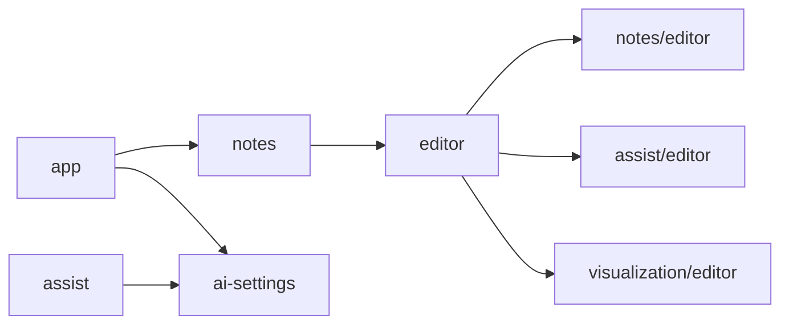

# Frontend — Feature Map

Feature는 **백엔드 도메인 경계**를 따른다. 페이지 기준(`note-list-feature`, `note-edit-feature`)으로 나누지 않는다. 예외는 `editor`와 `app`으로, 여러 feature를 조립하는 역할이다.

## Features

| Feature | 대응 도메인 | 책임 | 사용 IPC |
| --- | --- | --- | --- |
| `app` | — | 라우터, QueryClient, AppShell, Sidebar, 전역 단축키, 앱 종료 flush | `app:*` |
| `notes` | [note](../backend/note/overview.md) | 목록, 생성·삭제, 제목, **자동 저장**, 검색 팔레트, 연결·가져오기, 백링크, `noteLink` 편집기 노드 | `note:*`, `note-link:list` |
| `editor` | — (조립) | Tiptap 인스턴스 생성, 스키마 조립, `NoteEditor` 컴포넌트, 현재 편집기 핸들 제공 | 없음 |
| `assist` | [assist](../backend/assist/overview.md) | Bubble Menu, Job 요청·재시도, `aiPending` Mark + Selection Lock + Pulse, Job 이벤트 수신, **Commit** | `ai:*` |
| `visualization` | [visualization](../backend/visualization/overview.md) | `infographic` 노드 뷰, 유형별 SVG 렌더러, PNG 변환·저장 | `visualization:save-png` |
| `ai-settings` | [ai-provider](../backend/ai-provider/overview.md) | 설정 화면, 연결 테스트, **활성 Capability 제공**(assist가 버튼 잠금에 사용) | `settings:*` |

### 편집기와 feature의 관계

편집기 하나에 세 feature가 기능을 꽂는다. 각 feature는 자기 편집기 확장을 **자기 폴더**에 두고, `editor`는 조립만 한다.

```text
features/editor/createEditor.ts
  ├── StarterKit (문단, 제목, 목록, 코드 …)
  ├── notes/editor/noteLinkNode         { noteId, label }
  ├── assist/editor/aiPendingMark       { jobId } + selectionLockPlugin + jobDecorationPlugin
  └── visualization/editor/infographicNode { spec }
```

노드·Mark 이름과 속성은 백엔드 계약([note/api-contract.md](../backend/note/api-contract.md#renderer-본문-스키마-계약), [assist/api-contract.md](../backend/assist/api-contract.md#renderer-본문-스키마-계약))을 따른다.

## Feature 간 의존



- `assist → ai-settings`: 활성 Capability 조회(`useActiveCapabilities()`)만.
- `notes`, `visualization`, `ai-settings`는 서로 모른다.

## Data Access

컴포넌트는 `window.blink`를 직접 호출하지 않는다.

```text
Component
↓
Feature hook (useNoteList, useCreateJob, …)      features/*/api/
↓
blink client (타입: src/shared/ipc의 BlinkApi)   shared/api/blink.ts
↓
window.blink (preload)  또는  Mock 구현
```

- `BlinkApi` 타입은 Preload가 노출하는 것과 **같은 타입**(`src/shared/ipc`)이다. DTO를 다시 정의하지 않는다.
- IPC DTO를 그대로 UI 모델로 쓴다. 매핑 계층은 두지 않는다 — 백엔드 응답이 이미 표시용(`title`은 표시 제목, `preview`, `snippet`)으로 설계되어 있다.
- 오류는 `getBlink()` 클라이언트가 Envelope를 unwrap 하며 `BlinkIpcError(code)`로 throw 하므로 TanStack Query의 `error`로 받는다. (contextBridge는 Error의 `code`를 보존하지 않아 Preload에서 throw 하지 않는다.)

## Mock 전략

| 목적 | 구현 |
| --- | --- |
| 백엔드 없이 UI 개발 (`vite dev` 브라우저) | `window.blink`가 없으면 `createMockBlink()`(in-memory)를 주입 |
| 컴포넌트·흐름 테스트 | 같은 Mock을 테스트에서 직접 주입 |
| AI 흐름 | Mock `ai.createJob`이 1.5초 뒤 `onJobUpdated`로 RUNNING → COMPLETED(고정 결과) 발행. 실패 시나리오는 입력 텍스트에 `#fail:TIMEOUT` 등 표식으로 재현 |

Mock과 실제 구현이 같은 `BlinkApi` 타입을 구현하므로 교체 시 UI 수정은 없다.

## Rendering Boundary

SSR이 없으므로 Server/Client Component 구분이 없다. 대신 **프로세스 경계**가 그 역할을 한다.

| 처리 | 위치 |
| --- | --- |
| 데이터 원본(SQLite), AI 호출, 파일 쓰기, API Key | Main |
| 편집기 문서, UI 상태, SVG 렌더링, Canvas PNG 변환, Commit | Renderer |

## 소스 구조

```text
src/renderer/
├─ main.tsx
├─ app/                    # router, providers, AppShell, Sidebar, shortcuts, closeFlush
├─ features/
│  ├─ notes/
│  │  ├─ api/              # queries/mutations, query keys
│  │  ├─ autosave/         # AutosaveRegistry, SaveQueue (React 밖에서 수명 유지)
│  │  ├─ components/       # NoteList, NoteHeader, SearchPalette, NotePreviewPane, BacklinksPanel
│  │  ├─ editor/           # noteLinkNode + NoteLinkView
│  │  └─ model/            # sanitizeImportedContent, isBrokenLink
│  ├─ editor/              # createEditor, NoteEditor, ActiveEditorContext
│  ├─ assist/
│  │  ├─ api/              # jobs query, useJobEvents, useCreateJob, useRetryJob
│  │  ├─ editor/           # aiPendingMark, selectionLockPlugin, jobDecorationPlugin
│  │  ├─ commit/           # planCommit (순수 함수), applyCommit
│  │  ├─ components/       # AIActionBubble, JobFailureChip, AssistBridge
│  │  └─ model/            # canRunJob (src/shared/assist의 요구 Capability 사용)
│  ├─ visualization/
│  │  ├─ editor/           # infographicNode + InfographicView
│  │  ├─ renderers/        # Process/Hierarchy/Comparison/Mindmap + layout
│  │  ├─ theme/            # 인포그래픽 전용 토큰 (SVG 인라인용)
│  │  └─ export/           # svgToPng
│  └─ ai-settings/
│     ├─ api/
│     └─ components/       # AIProviderForm, CapabilityList, TestConnectionButton
├─ shared/
│  ├─ api/blink.ts         # BlinkApi 접근점 + mock 주입
│  ├─ ui/                  # tokens.css, Glass, Button, Chip, Dialog, Toast, IconBadge (도메인 모름)
│  └─ lib/
└─ mocks/                  # createMockBlink
```

`src/shared/`(프로세스 공용)와 `src/renderer/shared/`(Renderer 내부 공용 UI)는 다르다.
